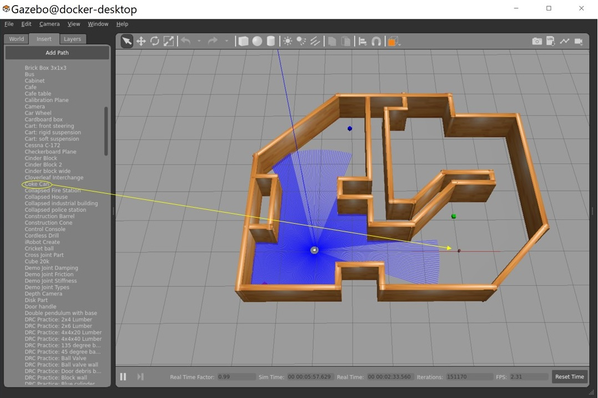
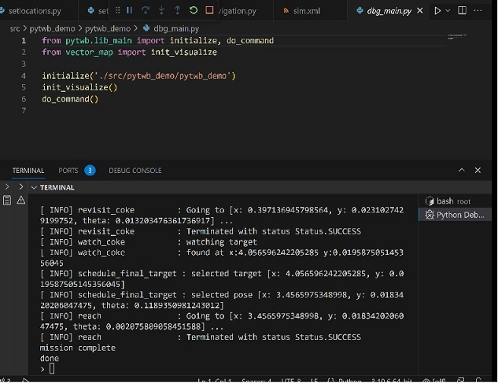
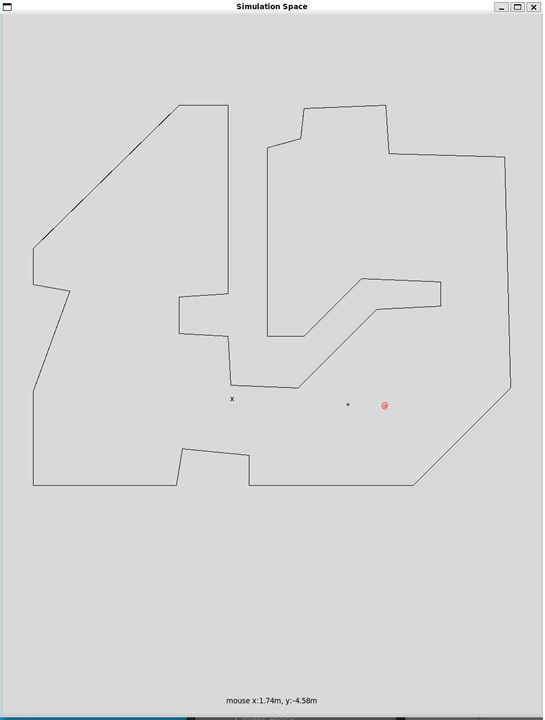

# pytwb_demo
The main purpose of the pytwb_demo is to provide a sample of a ROS application implemented using the functions of pytwb and vector_map libraries.

- [pytwb](https://github.com/momoiorg-repository/pytwb):
pytwb is a tool for behavior tree development and execution based on py_trees and py_trees_ros. It also has a function to execute behavior tree written in XML.

- [vector_map](https://github.com/RobotSpatialCognition/vector_map):
It has a function to output a vector format map by converting SLAM map described in occupancy grid format into a representation consisting of geometric straight lines and curves. In addition, it has a function to represent a group of areas in the map, such as rooms and corridors, as Python objects, add property information to them, and save them.

pytwb_demo implements an example of turtlebot3 searching for cola cans using the Realsense depth camera and a behavior tree in Python+XML.

The realization of the simulation environment is fully dependent on the GitHub sea-bass' [“turtlebot3_behavior_demos”](https://github.com/sea-bass/turtlebot3_behavior_demos). The invocation mechanism and settiongs of simulation (demo-world) of the turtlebot3_behavior_demos by Gazebo and Rviz is used as it is. pytwb_demo also uses part of the Python implementation of its behavior.

The pytwb_demo implements a behavior tree based commanding mechanism to the simulated turtlebot3 provided by turtlebot3_behavior_demos. 

So installing pytwb_demo starts with installing turtlebot3_behavior_demos, because pytwb_demo contains only the execution environment of behavior tree, and does not contain the part that executes it using turtlebot3. 

The demo as a whole corresponds to the pre-stage movement task to start a picking task (even though simulated turtlebot3 dones not have arm...). Inside a building with a complex shape, it automatically enumerates positions with good visibility, searches for cola cans using a camera while the robot moves to those points, and if it finds a cola can, it stops and looks again. Succeeding operations are implemented to confirm the position, measure the coordinates, calculate the position coordinates of the robot suitable for picking cola cans, and move to that point.

Here, by using pytwb and vector_map,
- Developing ROS behavior tree applications in incremental way,
- Analyze the SLAM map and choose a good vantage point,
- Locating objects on the move and calculating their coordinates,
- Calculate the coordinates of the work place of a picking robot relative to the object without interfering with the surroundings,

etc. are realized.

# Installation
First, install sea-bass' turtlebot3_behavior_demos. A run of Gazebo and Rviz is provided in "turtlebot3_behavior_demos". 

git clone https://github.com/sea-bass/turtlebot3_behavior_demos.git  
cd turtlebot3_behavior_demos  
docker compose build  
cd ..  

Please refer to the following for details.  
https://github.com/sea-bass/turtlebot3_behavior_demos  

Next, build pytwb_demo. As a prerequisite, the docker image of pytwb is required. So, first, do the following:  

git clone https://github.com/momoiorg-repository/pytwb.git  
cd pytwb  
docker image build -t pytwb:latest .  
cd ..  

After that, create a docker image of pytwb_demo.

git clone https://github.com/momoiorg-repository/pytwb_demo.git  
cd pytwb_demo  
docker image build -t pytwb_demo:latest .  
cd ..  

Now that it's ready to run, run two dockers.  
cd turtlebot3_behavior_demos  
docker compose up demo-world  

Here, change the model of turtlebot3 that demo-world executes and enable the depth function of realsense camera.  

open another bash terminal  
cd pytwb_demo  
docker cp ./model.sdf turtlebot3_behavior_demos-demo-world-1:/turtlebot3_ws/src/turtlebot3_simulations/turtlebot3_gazebo/models/turtlebot3_waffle_pi  
cd ..

Restart docker of world-demo.  
docker restart turtlebot3_behavior_demos-demo-world-1  
(change docker name based on your execution environment.)

The screens of Gazebo and Rviz are displayed, so place the coke can anywhere in the house from the "Insert" tab of Gazebo.  Pull down "http://models.gazebosim.org/" tab of Insert and pick up and place "coke can".

 It doesn't matter if you put more than one.

Then run pytwb_demo docker  

docker run -–name \<docker name\> --network host -it pytwb_demo  

In VSCode, attach to \<docker name\> and set the work directory to /root.  
Execute ./src/pytwb_demo/pytwb_demo/dbg_main.py from VSCode.

The "> " prompt is displayed in Terminal window of VSCode, so execute the following  
\> run sim

The simulation will now begin. The robot begins searching, finds a coke can in the process, calculates coordinates, and moves closer to it.  It terminates with displaying "mission complete".

 Also, a vectorized map and moving camera images will be displayed.

# Dependencies  
Special thanks to the following works:  
- [“turtlebot3_behavior_demos”](https://github.com/sea-bass/turtlebot3_behavior_demos) by sea-bass  
simulation environment of turtlebot3 using docker and basis of behavior tree implementation
- [lecture page of OpenCV and Python](https://demura.net/education/22777.html) by Demura Kiminari  
detection code of coke can image by OpenCV

# Documents  
- [pytwb_demo Code Explanation](doc/pytwb_ws.md)
- [pytwb documentation](https://github.com/momoiorg-repository/pytwb/tree/main/doc/overview.md) 
- [vector_map api](https://github.com/RobotSpatialCognition/vector_map/blob/main/doc/overview.md)